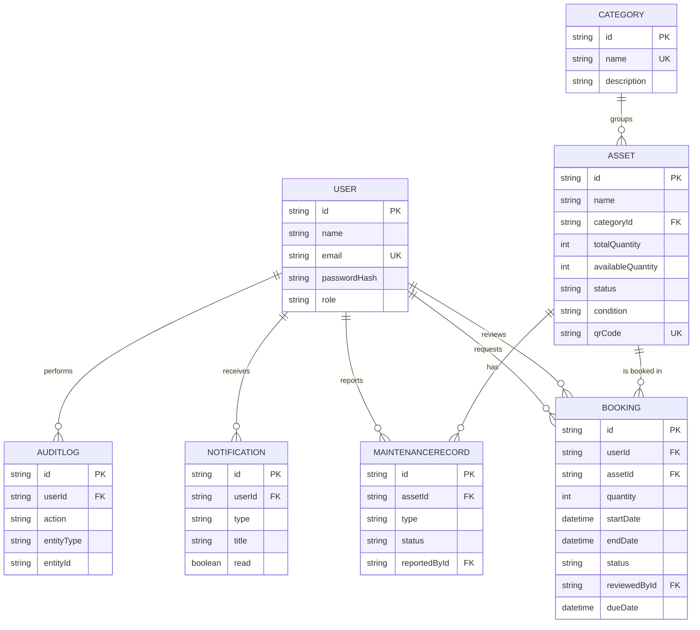
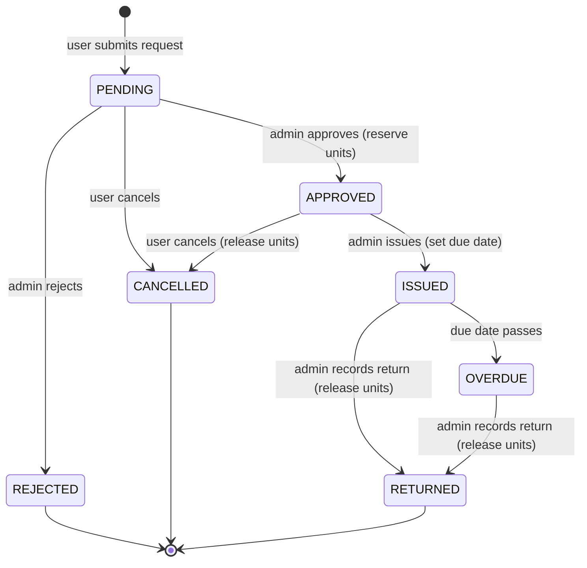

# AssetFlow — Design Document

**Smart Asset Management and Resource Allocation Platform**
Cult Open Projects 2026

---

## 1. Problem Understanding

The Cultural Council manages a large pool of shared physical resources — DSLR
cameras, studio lighting, audio systems, costumes, stage props, recording
equipment and event infrastructure. These are borrowed across many sections and
events. When this is coordinated through spreadsheets, registers and informal
chats, the result is predictable: double-booking, lost items, late returns, and
no visibility into what is actually available or how heavily it is used.

AssetFlow addresses this with a centralized, role-based platform that owns the
**entire lifecycle of an asset loan** and keeps inventory counts provably
consistent at every step.

**Primary actors**
- **Administrator** — curates inventory, approves/rejects requests, issues and
  receives returns, monitors utilization, and tracks asset health.
- **User (resource consumer)** — discovers assets, requests them for a date
  range, and tracks their bookings and history.

**Core goals**
1. A single source of truth for inventory and its availability.
2. A controlled request → approval → issue → return workflow.
3. **Data integrity**: available quantities never drift, and the system never
   commits more units than physically exist.
4. Operational insight through analytics.

---

## 2. System Architecture

AssetFlow is a classic, cleanly-separated three-tier web application.

```
┌────────────────────────┐      HTTPS / JSON       ┌──────────────────────────┐
│   Client (React SPA)    │  ───────────────────▶   │   API (Express + TS)      │
│                         │   Bearer JWT in header  │                           │
│  • React Router          │                         │  Middleware:              │
│  • TanStack Query (cache)│  ◀───────────────────   │   auth → validate → route │
│  • Tailwind UI           │      JSON responses     │  Modules (per feature):   │
│  • Recharts dashboards   │                         │   controller → service    │
└────────────────────────┘                         │            │              │
                                                     │       Prisma ORM          │
                                                     └────────────┼──────────────┘
                                                                  ▼
                                                       ┌────────────────────┐
                                                       │  SQLite / Postgres  │
                                                       └────────────────────┘
```

**Layering & request flow.** Every request passes through a consistent pipeline:
`authenticate` (verify JWT, attach user) → `requireAdmin` (where needed) →
`validate` (Zod schema) → **controller** (HTTP orchestration) → **service /
Prisma** (business logic & data access) → centralized **error handler** (maps
errors to clean JSON). This keeps concerns isolated and the code modular.

**Feature modules.** The backend is organized by domain — `auth`, `category`,
`asset`, `booking`, `analytics`, `notification`, `audit`, `maintenance` — each
with its own routes, controller, and (where relevant) schema/service files. New
features slot in without touching unrelated code.

**Frontend.** A single-page React app. Server state is managed by TanStack Query
(caching, background refetch, optimistic invalidation), auth state by a small
React context, and routing is guarded by role (`ProtectedRoute`). Components are
split into reusable UI primitives and feature pages.

**Deployment.** Docker Compose builds two images — the API (Node) and the
frontend (static build served by nginx, which also reverse-proxies `/api` to the
API). The database is SQLite by default (single file, zero setup) and the schema
is Postgres-ready for scale.

---

## 3. Data Model & Database Schema

Seven entities model the domain. (Enumerations are stored as validated strings
for SQLite portability.)

| Entity | Key fields | Purpose |
|--------|-----------|---------|
| **User** | name, email (unique), passwordHash, role | Accounts & RBAC |
| **Category** | name (unique), description | Grouping for assets |
| **Asset** | name, categoryId→Category, totalQuantity, **availableQuantity**, status, condition, location, qrCode (unique) | Inventory item |
| **Booking** | userId→User, assetId→Asset, quantity, startDate, endDate, status, reviewedById→User, dueDate, issuedAt, returnedAt | A loan through its lifecycle |
| **Notification** | userId→User, type, title, message, read | In-app alerts |
| **AuditLog** | userId→User, action, entityType, entityId, details | Tamper-evident activity trail |
| **MaintenanceRecord** | assetId→Asset, type, status, description, reportedById→User | Asset health / damage |

**Inventory integrity model.** `Asset.availableQuantity` represents *un-committed*
stock. Units are **reserved on approval** (decrement) and **released on return or
cancellation** (increment), all inside Prisma transactions so concurrent
approvals can never oversell. A request is validated against availability both at
submission and again at approval time. This is the heart of the data-integrity
guarantee.

### Entity-Relationship Diagram



---

## 4. Booking Lifecycle (State Machine)



Inventory side-effects are annotated in parentheses. The `OVERDUE` transition is
computed by a lightweight sweep that runs before any booking/analytics read, so
status is always current without a background scheduler.

---

## 5. API Overview

REST/JSON, prefixed with `/api`. Auth via `Authorization: Bearer <token>`.
Validation is enforced by Zod; errors return a consistent `{ error, details }`
shape with the right HTTP status.

| Method | Endpoint | Auth | Description |
|--------|----------|------|-------------|
| POST | `/auth/register` | – | Create a user account |
| POST | `/auth/login` | – | Authenticate, returns JWT |
| GET | `/auth/me` | user | Current user |
| GET | `/categories` | user | List categories |
| POST/PUT/DELETE | `/categories[/:id]` | admin | Manage categories |
| GET | `/assets` | user | Search/filter/paginate catalog |
| GET | `/assets/:id` | user | Asset detail (+ bookings, maintenance) |
| POST/PUT/DELETE | `/assets[/:id]` | admin | Manage assets |
| GET | `/assets/:id/qr` | user | QR code (PNG data URL) |
| GET | `/assets/lookup/:code` | user | Resolve a scanned QR code |
| POST | `/bookings` | user | Request an asset |
| GET | `/bookings` | user/admin | List (own, or all for admin) |
| PATCH | `/bookings/:id/approve` | admin | Approve (reserves units) |
| PATCH | `/bookings/:id/reject` | admin | Reject with note |
| PATCH | `/bookings/:id/issue` | admin | Issue, set due date |
| PATCH | `/bookings/:id/return` | admin | Record return (releases units) |
| PATCH | `/bookings/:id/cancel` | user | Cancel own request |
| GET | `/analytics/*` | admin | overview, most-used, distribution, utilization, trend |
| GET | `/notifications` | user | List + unread count |
| PATCH | `/notifications/:id/read`, `/read-all` | user | Mark read |
| GET | `/audit` | admin | System activity trail |
| GET/POST | `/maintenance` | admin/user | Health records & damage reports |
| PATCH | `/maintenance/:id` | admin | Update / resolve a record |

---

## 6. Design Decisions

1. **JWT (stateless) auth.** Tokens are signed server-side and verified per
   request; no session store is required, which keeps the API horizontally
   scalable. Passwords are hashed with bcrypt. Roles are embedded in the token
   and re-checked by middleware.

2. **Reserve-on-approval inventory.** Rather than decrementing stock at request
   time (which would let unconfirmed requests block resources) or only at issue
   time (which risks overselling), units are committed at the approval step
   inside a transaction. This is simple to reason about, prevents overbooking,
   and keeps `availableQuantity` meaningful at all times.

3. **Prisma + SQLite default, Postgres-ready.** SQLite gives evaluators a
   genuinely zero-config experience (`npm run db:setup` just works). Because all
   data access goes through Prisma, moving to PostgreSQL for production scale is
   a one-line provider change — demonstrating scalability without sacrificing
   reproducibility.

4. **Modular, layered backend.** Feature-based modules with a
   controller → service split keep business logic testable and the codebase easy
   to extend. Cross-cutting concerns (auth, validation, errors, audit,
   notifications) are centralized.

5. **Zod validation at the boundary.** All input is parsed and coerced at the
   edge, so controllers and services can trust their inputs and the client gets
   precise, field-level error messages.

6. **Server-state-first frontend.** TanStack Query removes a whole class of
   bugs around loading/caching/refetching and keeps the UI in sync after
   mutations via targeted cache invalidation. Tailwind provides a consistent,
   responsive design system.

7. **Auditing & notifications as services.** Both are written through a single
   service function and never block the primary operation (failures are logged,
   not thrown), making it trivial to add new audited actions or a future email
   channel behind the same interface.

### Scalability & Future Work
- Swap SQLite → PostgreSQL (provider + URL) for concurrent write scale.
- Move the overdue sweep to a scheduled job (e.g. cron) for very large datasets.
- Add an email/push notification channel behind the existing `notify()` service.
- Introduce date-range overlap checks for time-slotted reservations.
- Add automated tests around the booking state machine and inventory math.
```
